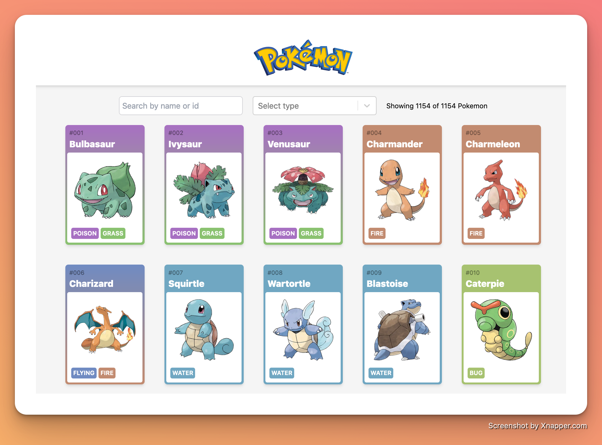

# Pokedex

I built this pokedex app with **React**, **Next.js** and **Tailwind**. I used an external API for the Pokemon data. You can view the live site [here](https://pokedex-next-app.netlify.app/). The site is hosted on Netlify.

### Build Setup

The home page contains a list of all Pokemon, and each Pokemon has its own details page.

The home page is server-side generated (SSG), allowing me to prefetch data from the API and serve a lightening fast static page.

Given the large number of Pokemon, using a similar SSG approach for the individual Pokemon pages would be suboptimal. The Pokemon pages are still server-side rendered but only at the time of each page request (SSR).

### Features added:

- 🔍Search by name or id
- ❌ Filter by type
- ♾ Infinite scrolling † 

### Challenges overcome:

- Optimizing the number of API calls from 1,155 to 21
- Creating a custom useInfiniteScroll hook

† I understand that infinite scroll is a nightmare for performance without windowing. Given the nature of this project, I didn't feel it was necessary. 

In a larger project, with actual users,  I would implement windowing functionality or use something like [react-window](https://react-window.vercel.app/#/examples/list/fixed-size).
